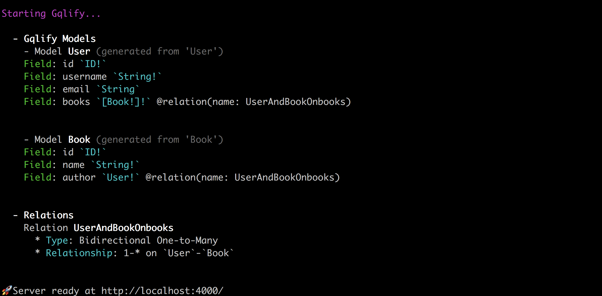

Datamodel is written by GraphQL Schema Definition Language (SDL).

The datamodel in GQLify serves following purposes:
1. **Defining database schema**: it tells GQLify what fields you have in models.
2. **Data-source**: with `@GQLifyModel(dataSource: "dataSource")`, GQLify will know where you want to save your data.
3. **Relationship**: by defining `GQLifyModel` type in field, you're telling GQLify to build relationship on the model.


## Example
```graphql
type User @GQLifyModel(dataSource: "memory", key: "users") {
  id: ID! @unique @autoGen
  username: String!
  email: String
  books: [Book!]!
}

type Book @GQLifyModel(dataSource: "memory", key: "books") {
  id: ID! @unique @autoGen
  name: String!
  author: User!
}
```

The example above illustrates some important concepts when working with datamodel:

1. The two types User and Book represent a `Model` in GQLify, which also represent database tables, or equivalent term for NoSQL.
2. There is a bi-directional one-to-many relation between User and Book (via `User.books` field and `Book.author` field).
3. The `id` field of User and Book is under unique constraint (with `@unique`) and also auto-generated on server-side (with `@autoGen`).
4. Fields with exclamation mark (!) followed means they're required in query and should be carried with create mutation.

After defining datamodel, simply run the server and you'll see the following overview messages with defined fields with types and relationships between types.



## What will be covered?
> We'll cover types you can use in datamodel in [Scalar Types](/docs/scalar-types) and [Object Types](/docs/object-types).

> As relationship usage, we'll cover it at [Relationships](/docs/data-model-relationships)

> As usage of directives like `@unique`, `@autoGen`, we'll cover it at [Schema directives](/docs/schema-directives)

> As customized enum and scalars, we'll cover them at [Enum Types](/docs/enum-types) and [Add new Scalar](/docs/add-new-scalar).
