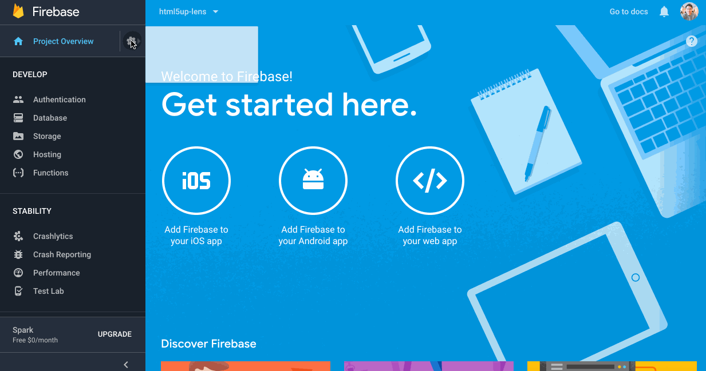

## 1. download serviceAccount.json


## 2. Construct Firebase data-source
```js
const { Gqlify } = require('@gqlify/server');
const { FirebaseDataSource } = require('@gqlify/firebase');
const cert = require('/path/to/serviceAccount.json');
const databaseUrl = 'https://databaseName.firebaseio.com';

const gqlify = new Gqlify({
  sdl: ...,
  dataSources: {
    firebase: args => new FirebaseDataSource(cert, databaseUrl, args.key),
  },
});
```

## 3. Use in datamodel
```graphql
type User @GQLifyModel(dataSource: "firebase", key: "users") {
  id: ID! @unique @autoGen
  name: String
}
```


