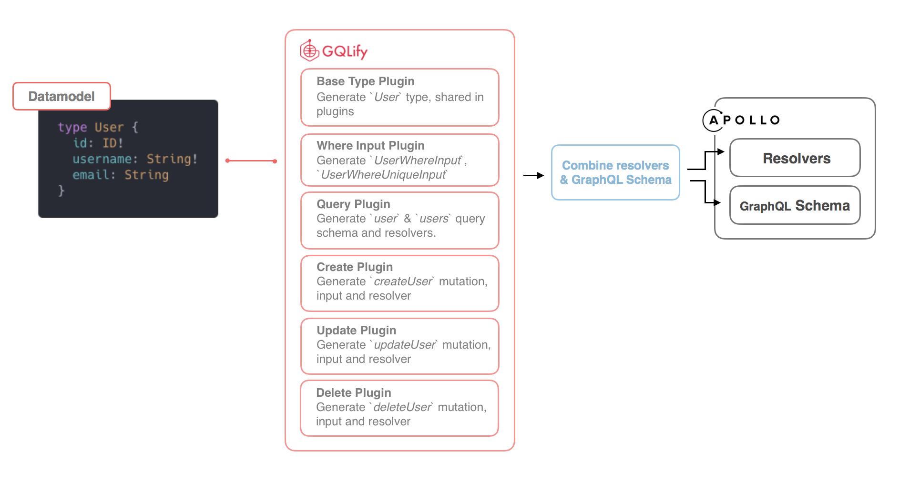

## How GQLify auto-generates GraphQL API?
GQLify auto-generates GraphQL with plugins.

1. GQLify will visit each `plugin` with models.
2. `plugin` is responsible for generate `GraphQL schema` and `resolvers` for each model.
3. After visiting all models, GQLify combines `resolvers` and `GraphQL schema` from `plugin`.
4. GQLify outputs combined result as config to Apollo-server.

## What queries does GQLify generate now?
> You can learn about it at [GraphQL Queries](/docs/graphql-api-queries) section.

## What mutations does GQLify generate now?
> You can learn about it at [GraphQL Mutations](/docs/graphql-api-mutations) section.

## What is GQLify Plugin?
GQLify Plugin is responsible for generate GraphQL schema and resolvers for each model. Think `Plugin` as a way to modulize your GraphQL application.
> [Learn more about Plugin](/docs/graphql-api-plugins)

## What plugins does GQLify have now?
Currently, we have 6 plugins for different jobs.
* [Base Type Plugin](/docs/graphql-api-base-type-plugin): generate base type of model. The types can be shared and reused between plugins.
* [Where Input Plugin](/docs/graphql-api-where-input-plugin): generate where input of model. The inputs can be shared and reused between plugins.
* [Query Plugin](/docs/graphql-api-query-plugin): generate queries that can find one record and find many records with filter in data-source.
* [Create Plugin](/docs/graphql-api-create-plugin): generate mutations that can create record in data-source.
* [Update Plugin](/docs/graphql-api-update-plugin): generate mutations that can update record in data-source.
* [Delete Plugin](/docs/graphql-api-delete-plugin): generate mutations that can delete record in data-source.

## How do I create own plugin
> Lean more from [Create your own plugin](/docs/graphql-api-create-own-plugin) section.
