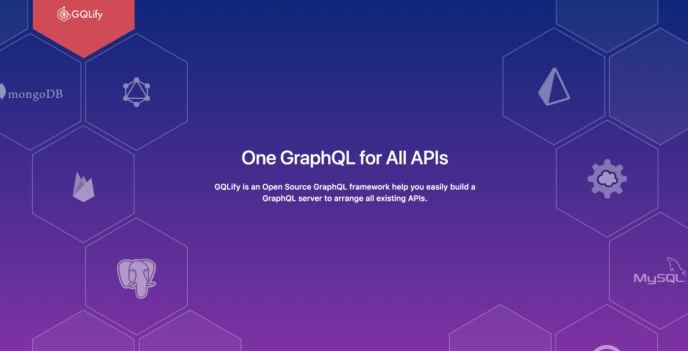

## About GQLify
Building a graphQL server could be hard! All the maintenance efforts around graphQL schema, resolver logics and relationship between different APIs really take developers lots of time.

GQLify let developers build a complete graphQL server with only one datamodel file.

```graphql
type User @GQLifyModel(dataSource: "memory", key: "users") {
  id: ID! @unique @autoGen
  username: String!
  email: String
  books: [Book!]!
}

type Book @GQLifyModel(dataSource: "memory", key: "books") {
  id: ID! @unique @autoGen
  name: String!
  author: User!
}
```

With datamodel above, you get all the graphQL APIs with relationship built-in.

✨ See for yourself!

Try this query in our playground
```graphql
{
  books {
    id
    name
    author {
      id
      username
    }
  }
}
```
<iframe src="https://codesandbox.io/embed/p7wqo43zpx?module=%2Fdatamodel.graphql" style="width:100%; height:500px; border:0; border-radius: 4px; overflow:hidden;" sandbox="allow-modals allow-forms allow-popups allow-scripts allow-same-origin"></iframe>

## Learn more
* [Quickstart](/docs/quick-start)
* [Why GQLify](/docs/why-gqlify)
