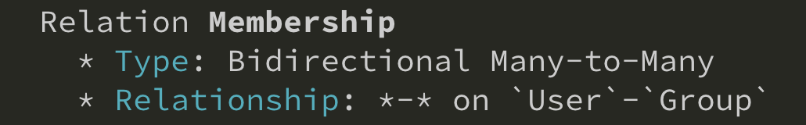

You can use directive `relation` to tell GQLify many-to-many relationship between two types. Directive `relation` has one parameter `name`. With many-to-many relationship, please define same `name` on field of two types. Like one user can join many groups, and one group can include many users.

```graphql
type User @GQLifyModel(dataSource: "memory", key: "users")  {
  groups: [Group!]! @relation(name: "Membership")
}

type Group @GQLifyModel(dataSource: "memory", key: "groups")  {
  users: [User!]! @relation(name: "Membership")
}
```

Above relationship will be detect as bidirectional many-to-many relationship.


