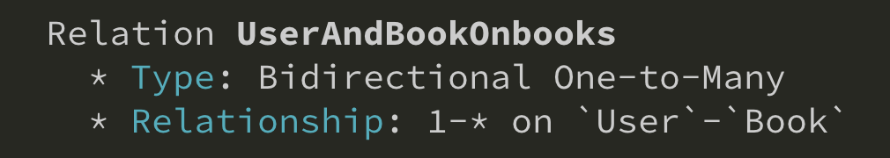
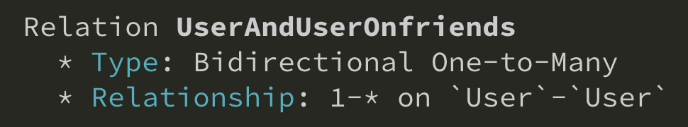

One-to-Many relationship can be auto detected by GQLify. Just define a field of type map to array of another type. Like an user can be author of many books.

```graphql
type User {
  books: [Book!]!
}

type Book {
  author: User!
}
```

GQLify will auto detect above relationship as bidirectional one-to-many-relationship.



You can also define a field map to array of it's type. Like an user has many friends.

```graphql
type User {
  friends: [User!]!
}
```

Above relationship also can be detected as one-to-many relationship.


