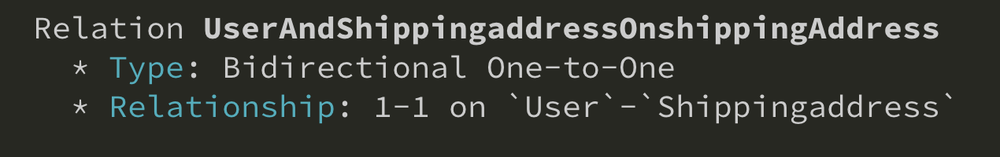
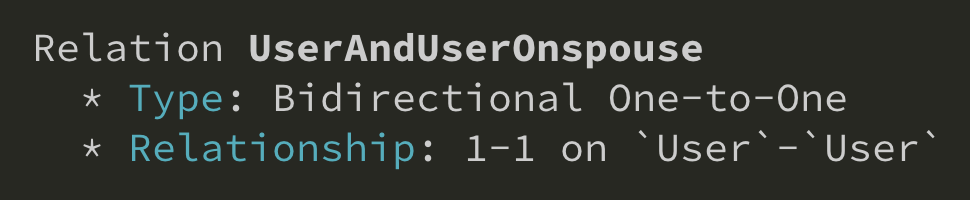

One-to-One relationship can be auto detected by GQLify. Just define a field of type map to another type. Also, on another type, define a field map to the type. Following example is one user mapping to one shipping address.

```graphql
type User @GQLifyModel(dataSource: "memory", key: "users") {
  shippingAddress: ShippingAddress!
}

type ShippingAddress @GQLifyModel(dataSource: "memory", key: "shippingAddress") {
  user: User!
}
```

GQLify auto detect above relationship as bidirectional one-to-one relationship.



You can also define a field map to it's type. Like one person has one spouse.

```graphql
type User @GQLifyModel(dataSource: "memory", key: "users") {
  spouse: User!
}
```

Above relationship also can be detected as one-to-one relationship.


