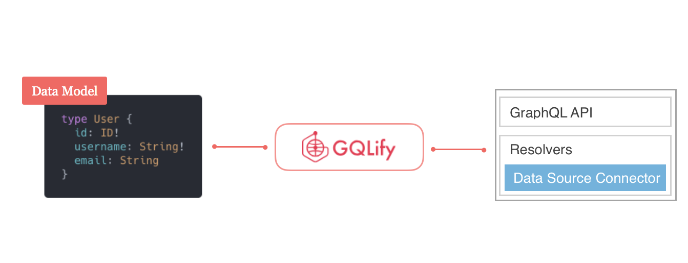
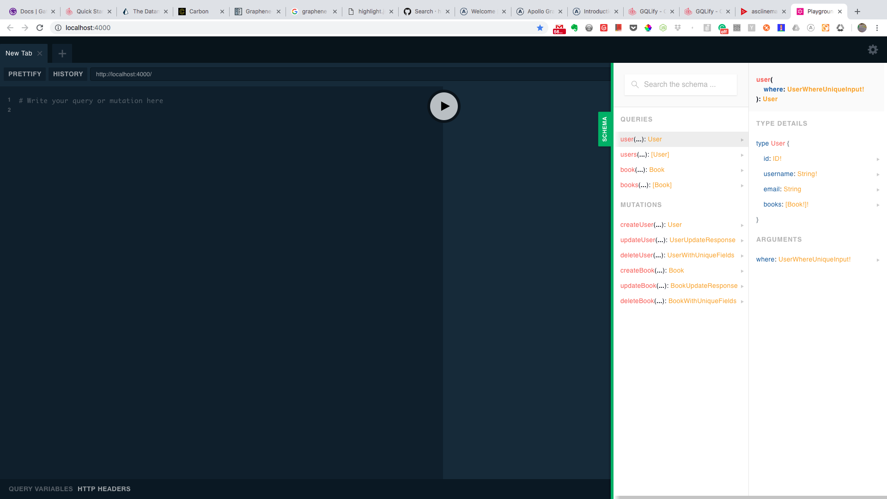

GQLify deals with the heavy lifting jobs of GraphQL API development, so you can simply define a datamodel and your GraphQL server is done!



## Goals

* Setup GQLify
* Setup Datamodel
* Start GQLify with Apollo Server

## Setup GQLify

### Create new directory

```shell
$ mkdir gqlify-demo
$ cd gqlify-demo
```

### Install GQLify

Initialize project in current directory and install `@gqlify/server`.

```shell
$ yarn init -y
$ yarn add @gqlify/server
```

## Setup Datamodel

In `demo.graphql`, let's define a datamodel with user and book as follows:

```graphql
type User @GQLifyModel(dataSource: "memory", key: "users") {
  id: ID! @unique @autoGen # auto generate unique id
  username: String!
  email: String
  books: [Book!]! # User-Book: one-to-many
}

type Book @GQLifyModel(dataSource: "memory", key: "books") {
  id: ID! @unique @autoGen # auto generate unique id
  name: String!
  author: User!
}
```

### About directives
* `@GQLifyModel`: `GQLifyModel` directive is to tell GQLify that this object type is a datamodel and should create GraphQL API around it.
  * `dataSource: "memory"`: for this demo, we use memory data-source for quick bootstrap.

* `@unique`: `unique` directive expresses a unique constraint, telling GQLify that there never will be two nodes with the same values.

You can learn more about data modeling from [`Datamodel` section](/docs/data-model-overview).

## Start GQLify with Apollo Server

### Prepare required packages

```shell
$ yarn add apollo-server
```

### Setup GQLify with Apollo Server

Add following code to `index.js`:

```js
const { Gqlify, MemoryDataSource } = require('@gqlify/server')
const { ApolloServer } = require('apollo-server');
const { readFileSync } = require('fs');

// Read datamodel
const sdl = readFileSync(__dirname + '/demo.graphql', { encoding: 'utf8' });

// mock default data
const defaultData = {
  users: [
    {id: '1', username: 'Alice', email: 'alice@gmail.com'},
    {id: '2', username: 'Bob', email: 'bob@gmail.io'},
  ],
  books: [
    {id: '1', name: 'book1', userId: '1'},
    {id: '2', name: 'book2', userId: '2'},
  ],
};

// construct gqlify
const gqlify = new Gqlify({
  // provide datamodel to gqlify
  sdl,

  // provide data-sources map to GQLify,
  // so GQLify would know how to create data-source for each model
  dataSources: {
    memory: args => new MemoryDataSource(defaultData[args.key]),
  },
});

// GQLify will provide GraphQL apis & resolvers to apollo-server
const server = new ApolloServer(gqlify.createApolloConfig());

// start server
server.listen().then(({ url }) => {
  console.log(`🚀 Server ready at ${url}`);
});
```

Next, execute `index.js` to start GraphQL server:

```shell
$ node index.js
```


You can see all the fields and relations you defined.

Then, open `http://localhost:4000` to see your GraphQL playground.




GQLify will auto-generate all GraphQL apis you need. You don't need to write any other code.

## Demo
<iframe src="https://codesandbox.io/embed/p7wqo43zpx?module=%2Fdatamodel.graphql" style="width:100%; height:500px; border:0; border-radius: 4px; overflow:hidden;" sandbox="allow-modals allow-forms allow-popups allow-scripts allow-same-origin"></iframe>

## Learn more
* [Learn more about why using GQLify](/docs/why-gqlify)
* [Learn more about data modeling]((/docs/data-model-overview))
* [Learn more about auto-generated GraphQL APIs](/docs/graphql-api)
