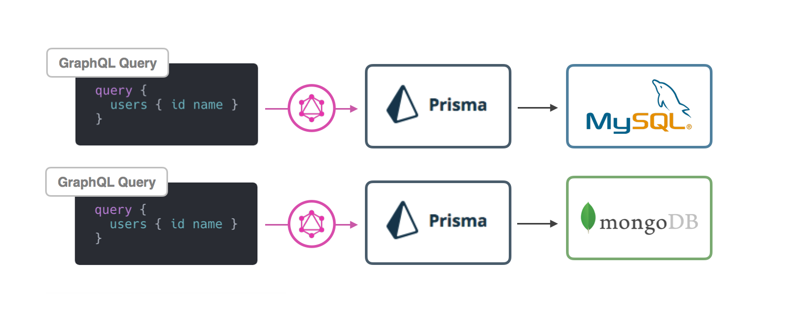
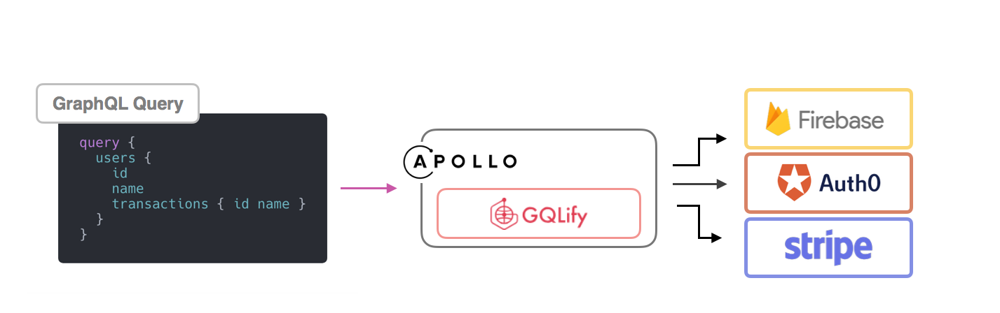
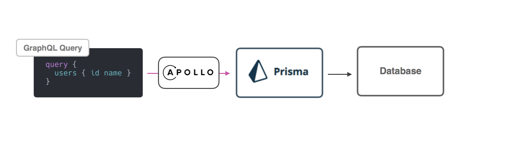
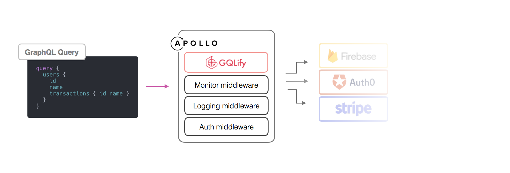

**Hey there!** You're probably wondering what the differences are between GQLify and a Prisma, so we thought we'd give put together a quick overview.

**First of all, GQLify and Prisma are different solutions serve different purposes.**

Below, you'll find the key highlights which we think are the most significant differences between GQLify and Prisma.

## ❓ Problem addressed
Prisma is an ORM layer that simplifies database access and data migration, so one Prisma service should serve one database.

**For GQLify, the story is different.**

Today, an e-commerce application might put their product inventory data in `Shopify`, user data in `Auth0`, search API on `Algolia` and articles on CMS platform.

At GQLify, we saw the potential to use GraphQL to connect all data-sources at once.

For your information, We're working on connecting to `Prisma` as well!

> Learn more about [GQLify data-source](/docs/data-source-overview)

> Learn more about [How we deal with relationship](/docs/relationship-overview)

## 🏗 Architecture
Since Prisma is an ORM layer, it requires a gateway server (GraphQL or Restful Server) delivering requests to Prisma.

For GQLify, since it's built with Javascript, GQLify can be integrated with [`Apollo-server`](https://www.apollographql.com/docs/apollo-server/), [`graphql-yoga`](https://github.com/prisma/graphql-yoga), [`graphql-middleware`](https://github.com/prisma/graphql-middleware) and other modules in GraphQL ecosystem to provide more flexible authentication and business logic as a **GraphQL gateway**.

## 🔗 Extending Framework
Prisma deals with heavy lifting jobs of database for you, so it's not a good place to do customization like adding a custom scalar, adding a query/mutation or dealing with business logics.

For GQLify, adding a enum, or adding custom scalar is as easy as doing it in apollo-server.

> Learn about [adding enum type](/docs/enum-types)

> Learn about [adding a custom scalar](/docs/add-new-scalar)

Furthermore, we provide `Plugin` let developers customize the queries and mutations.

> Learn about [Plugin](/docs/graphql-api-overview)

## TLDR: The short version
Cut to the chase? GQLify is for making it easier to connect to multiple data-sources in one GraphQL API. Prisma is better for when you need a tool to deal with data management and migration of single database.

### GQLify is suitable for you if…
1. You need a GraphQL gateway.
2. You already have multiple data-sources and want to connect them.
3. You need to extend the GraphQL API for your own requirements.

### Prisma is suitable for you if…
1. You don't want to deal with tasks regarding database management and migration.
2. You already build your own GraphQL server and simply need a ORM layer to access data.
