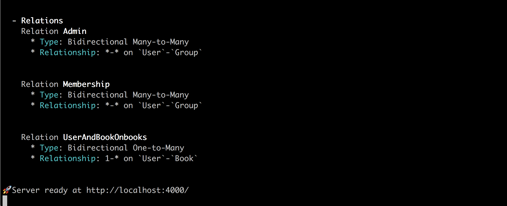

GraphQL makes data fetching really clear by providing type-safe query language.

```graphql
# You always get what you expected!
{
  users {
    id
    name
  }
}
```

Under the surface, GraphQL server is a lot of work. You need to write GraphQL schema and resolvers. Not to mention designing GraphQL API including relationship is not easy.

When you connect GraphQL with data-source, you must carefully handle request cache, N+1 problem ...etc.

So, what GQLify can help you with?

## Maintenance of GraphQL Schema
### 😞 Without GQLify
You need to write GraphQL schema, take the demo application in quickstart for example, if you write the whole GraphQL schema by yourself:

```graphql
type Book {
  id: ID!
  name: String!
  author: User!
}

input BookCreateInput {
  name: String
  author: BookCreateOneInput
}

input BookCreateOneInput {
  create: BookCreateInput
  connect: UserWhereUniqueInput
}

input BookUpdateInput {
  name: String
  author: BookUpdateOneInput
}

input BookUpdateOneInput {
  create: UserCreateInput
  connect: UserWhereUniqueInput
  disconnect: Boolean
  delete: Boolean
}

type BookUpdateResponse {
  id: ID
}

input BookWhereInput {
  id: ID
  name: String
}

input BookWhereUniqueInput {
  id: ID
}

type BookWithUniqueFields {
  id: ID
}

scalar JSON

type Mutation {
  createUser(data: UserCreateInput!): User
  updateUser(where: UserWhereUniqueInput, data: UserUpdateInput!): UserUpdateResponse
  deleteUser(where: UserWhereUniqueInput!): UserWithUniqueFields
  createBook(data: BookCreateInput!): Book
  updateBook(where: BookWhereUniqueInput, data: BookUpdateInput!): BookUpdateResponse
  deleteBook(where: BookWhereUniqueInput!): BookWithUniqueFields
}

type Query {
  user(where: UserWhereUniqueInput!): User
  users(where: UserWhereInput, first: Int, last: Int, before: String, after: String): [User]
  book(where: BookWhereUniqueInput!): Book
  books(where: BookWhereInput, first: Int, last: Int, before: String, after: String): [Book]
}

type User {
  id: ID!
  username: String!
  email: String
  books: [Book!]!
}

input UserCreateInput {
  username: String
  email: String
  books: UserCreateManyInput
}

input UserCreateManyInput {
  create: [UserCreateInput]
  connect: [BookWhereUniqueInput]
}

input UserUpdateInput {
  username: String
  email: String
  books: UserUpdateManyInput
}

input UserUpdateManyInput {
  create: [BookCreateInput]
  connect: [BookWhereUniqueInput]
  disconnect: [BookWhereUniqueInput]
  delete: [BookWhereUniqueInput]
}

type UserUpdateResponse {
  id: ID
}

input UserWhereInput {
  id: ID
  username: String
  email: String
}

input UserWhereUniqueInput {
  id: ID
}

type UserWithUniqueFields {
  id: ID
}
```

Every time you change API or add a new resource, you'll have to add `type`, `input`, queries and CRUD mutations all over again...

### 💪 With GQLify
You no longer need to maintain the GraphQL Schema, GQLify auto-generates all GraphQL Schema for you, including queries and CRUD mutations, with only a few lines of code in datamodel.

```graphql
type User @GQLifyModel(dataSource: "memory", key: "users") {
  id: ID! @unique @autoGen
  username: String!
  email: String
  books: [Book!]!
}

type Book @GQLifyModel(dataSource: "memory", key: "books") {
  id: ID! @unique @autoGen
  name: String!
  author: User!
}
```

#### GraphQL Playground demo
See for yourself!
<iframe src="https://codesandbox.io/embed/p7wqo43zpx?module=%2Fdatamodel.graphql" style="width:100%; height:500px; border:0; border-radius: 4px; overflow:hidden;" sandbox="allow-modals allow-forms allow-popups allow-scripts allow-same-origin"></iframe>

## Relationship is hard to deal with
### 😞 Without GQLify
When your application becomes complicated, you'll need mutation to handle relation.

For example, you'll probably need mutation like this:

```graphql
# create a new user with connected books
mutation {
  createUser(
    data: {
      username: "newuser",
      books: { connect: [{ id: "bookId" }] }
    }) {
      id
    }
}
```

As resolver, you'll have to write mutation resolver dealing with data creation and relation binding, which is tiring to deal with.

Not just create, you have to implement according relation logics for `update`, `delete` and `query`. As application grows, it's harder and harder to maintain these logics.

### 💪 With GQLify

GQLify automatically generate queries and mutations for you, including all the relation logics.

```graphql
type User @GQLifyModel(dataSource: "memory", key: "users") {
  id: ID! @unique @autoGen
  username: String!
  email: String
  books: [Book!]!
  adminedGroups: [Group!]! @relation(name: "Admin")
  belongedGroups: [Group!]! @relation(name: "Membership")
}

type Book @GQLifyModel(dataSource: "memory", key: "books") {
  id: ID! @unique @autoGen
  name: String!
  author: User!
}

type Group @GQLifyModel(dataSource: "memory", key: "groups") {
  id: ID! @unique @autoGen
  name: String!
  admins: [User!]! @relation(name: "Admin")
  members: [User!]! @relation(name: "Membership")
}
```

When you start your server, GQLify will print relations between models to let you understand the whole picture.



#### GraphQL Playground demo
Besides clear relationship overview, the built in GraphQL API is easy to use as well.

<iframe src="https://codesandbox.io/embed/1ql2o8nv9q" style="width:100%; height:500px; border:0; border-radius: 4px; overflow:hidden;" sandbox="allow-modals allow-forms allow-popups allow-scripts allow-same-origin"></iframe>

## Multiple data-source
Today, an e-commerce application might put their product inventory data in `Shopify`, user data in `Auth0`, search API on `Algolia` and articles on CMS platform.

GraphQL provides possibility to serve data from all these different sources. That being said, it's still hard to write all the logics dealing all the data-sources from scratch.

### 😞 Without GQLify
You'll need to deal with following:
1. Design GraphQL schema
2. Design relationship between different data-sources
3. Write resolvers for queries/mutations and their return types

All these tasks will take you several weeks, even months to deal with.

### 💪 With GQLify
GQLify is an API agnostic framework, so it's easier to define relationship between data-sources in GQLify datamodel.

```graphql
type User @GQLifyModel(dataSource: "auth0") {
  id: ID! @unique @autoGen
  username: String!
  email: String
  books: [Book!]!
  transactions: [Transaction!]!
}

type Book @GQLifyModel(dataSource: "firebase", key: "books") {
  id: ID! @unique @autoGen
  name: String!
  author: User!
}

type Transaction @GQLifyModel(dataSource: "stripe", key: "transaction") {
  id: ID! @unique @autoGen
  amount: Float
}
```

With simple declaration, your GraphQL server is done!
